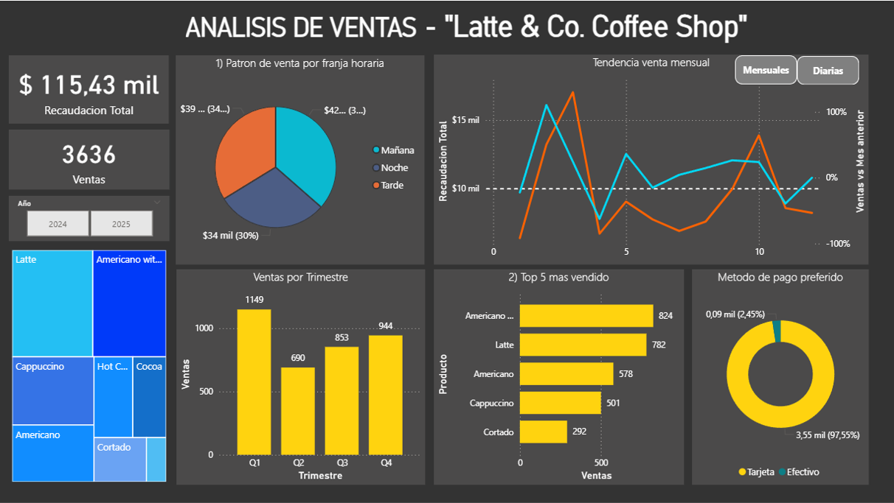

# Coffee Shop Sales Analysis

## Descripción general
Este proyecto tiene como objetivo **analizar los patrones de venta de una coffee shop** para identificar los horarios de mayor consumo, los productos más rentables y evaluar el estado real de las ventas a lo largo del día.  
El análisis permite obtener una visión integral del rendimiento comercial y de los hábitos de consumo de los clientes.

---

## Dataset
El dataset utilizado proviene de **datos reales** de un café.  
Contiene información detallada de las ventas, incluyendo:

- Fecha y hora de la transacción  
- Producto vendido  
- Tipo de pago  
- Día de la semana y mes  
- Precio unitario y total  

Estos datos fueron procesados y analizados para descubrir patrones significativos de comportamiento y rendimiento.

---

## Tecnologías utilizadas
- **Power BI** → para el desarrollo del dashboard interactivo  
- **Excel** → para la limpieza y estructuración inicial de los datos  

---

## Metodología
1. **Limpieza de datos:** depuración y estandarización de los registros.  
2. **Análisis exploratorio:** identificación de tendencias y relaciones entre variables.  
3. **Visualización:** diseño de gráficos e indicadores clave de rendimiento (KPIs).  
4. **Segmentación:** agrupamiento de ventas según tipo de producto, horario y medio de pago.  

---

## Principales resultados
-  **El 60% de las ventas proviene de café para llevar.**  
-  **El horario pico de ventas se concentra entre las 8:30 y 10:00 hs.**  
-  **La mayoría de los picos de venta ocurren durante la mañana.**  
-  **El producto más consumido es el “Americano with milk”.**

---

## Visualizaciones
A continuación, se muestra una vista previa del dashboard desarrollado en Power BI:  

## 🚀 Próximos pasos
- Incorporar un **sistema de fidelización de clientes** basado en su recurrencia.  
- Desarrollar un **modelo predictivo de demanda horaria**, utilizando datos en tiempo real para optimizar la operación y la planificación de recursos.

---

## Autor
**Facundo Reta**  
Ingeniero Electrónico | Ingeniero de proyectos | Data & Project Enthusiast  
[Contacto](linkedin.com/in/facundo-reta-48513a13)

---
